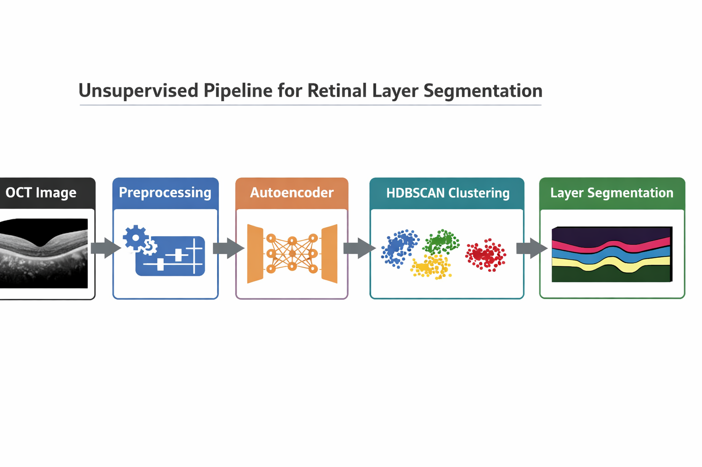
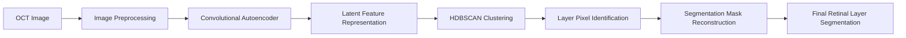
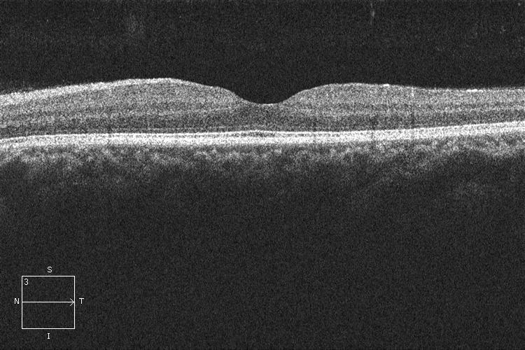
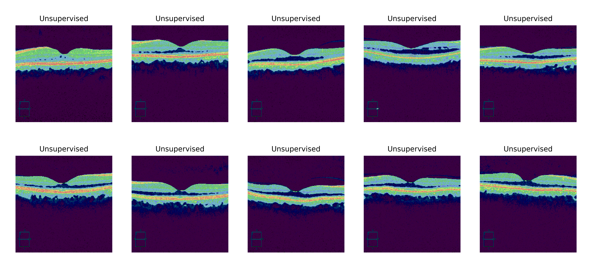

# Retinal Layer Segmentation in OCT Images using Unsupervised Deep Learning

Deep learning pipeline for **retinal layer segmentation in Optical Coherence Tomography (OCT) images** using an **unsupervised autoencoder-based approach**.

The system learns structural patterns from OCT scans and segments retinal layers **without requiring manual annotations**.

This project demonstrates a full **medical image segmentation workflow** including:

* data preprocessing
* deep representation learning
* clustering-based segmentation
* visualization of retinal layers

---

# Project Overview





---

# Research Motivation

Retinal layer analysis is an important step in diagnosing ophthalmic diseases such as:

* Diabetic Retinopathy
* Glaucoma
* Age-related Macular Degeneration

Manual annotation of retinal layers in OCT scans is **expensive and time-consuming**.

This project explores an **unsupervised deep learning approach** that learns structural representations from OCT images and automatically segments retinal layers **without requiring labeled data**.

---

# Project Highlights

* Fully **unsupervised retinal layer segmentation**
* **Convolutional autoencoder** for feature learning
* **HDBSCAN clustering** for structure extraction
* Visualization of segmented retinal layers
* Implemented using **PyTorch**

---

# Example Result

| Input OCT Image                | Segmented Retinal Layers              |
| ------------------------------ | ------------------------------------- |
|  |  |

---

# Project Pipeline

1. OCT Image Acquisition
2. Image Preprocessing
3. Autoencoder Feature Learning
4. Latent Feature Extraction
5. HDBSCAN Clustering
6. Segmentation Mask Reconstruction
7. Visualization of Retinal Layers

---

# Repository Structure

```
Retinal-Unsupervised-Segmentation
│
├── data
│   └── images
│
├── models
│   └── best_autoencoder.pth
│
├── outputs
│   ├── input_example.png
│   └── retinal_segmentation.png
│
├── docs
│   └── pipeline_overview.png
│
├── src
│   ├── dataset.py
│   ├── train.py
│   └── utils.py
│
├── main.py
├── README.md
├── requirements.txt
└── .gitignore
```

---

# Installation

Clone the repository:

```
git clone https://github.com/annikanatarajan1-design/Retinal-Unsupervised-Segmentation.git
cd Retinal-Unsupervised-Segmentation
```

Install dependencies:

```
pip install -r requirements.txt
```

---

# Quick Start

Run the segmentation pipeline:

```
python main.py
```

---

# Data Source

Retinal OCT images used in this project were obtained from a **university laboratory dataset**.

Due to dataset usage restrictions, the full dataset cannot be publicly distributed in this repository.

Dataset details:

* Total images: **256**
* Image format: **PNG**
* Average image size: **~260 KB**

A small sample is included in:

```
data/images/
```

Users may replace the images in this directory with their own OCT datasets.

---

# Running the Project

Train the autoencoder:

```
python src/train.py
```

Run segmentation pipeline:

```
python main.py
```

---

# Model

The segmentation system is based on a **Convolutional Autoencoder** that learns compressed feature representations of OCT images.

Architecture components:

* **Encoder** – extracts structural retinal features
* **Latent space** – compressed feature representation
* **Decoder** – reconstructs retinal structure

Latent representations are clustered using **HDBSCAN** to identify distinct retinal layers.

---

# Results

The model successfully extracts **retinal layer structures** from OCT images without requiring segmentation labels.

Key advantages:

* No manual annotation required
* Works with relatively small datasets
* Captures structural retinal information

---

# Limitations

* Performance may vary across OCT datasets
* Some thin retinal layers may be difficult to separate
* Model sensitive to OCT image quality

---

# Future Improvements

Possible extensions include:

* U-Net based segmentation
* Self-supervised representation learning
* Multi-scale retinal feature extraction
* Quantitative evaluation using **Dice score / IoU**

---

# Technologies Used

* Python
* PyTorch
* OpenCV
* NumPy
* Scikit-Learn
* HDBSCAN

---

# Citation

If you use this repository in research or projects, please cite:

Annika Natarajan (2026)
**Unsupervised Retinal Layer Segmentation using Deep Learning**
GitHub Repository.

---

# Author

**Annika Natarajan**
Machine Learning • Computer Vision • Medical Imaging
